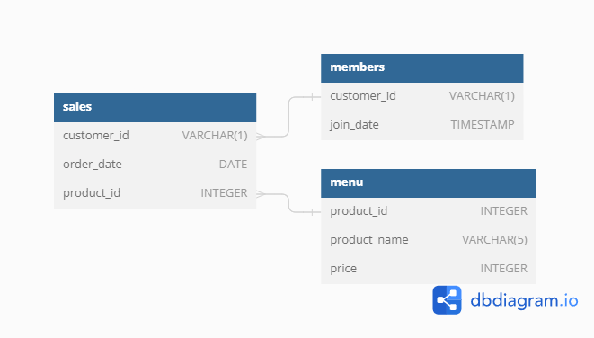

# Data With Danny 8 Weeks SQL Challenge

Welcome to my repository for the Data With Danny 8 Weeks SQL Challenge. This repository contains my solutions and insights for each week's case study.

### [Week 1: Danny's diner]

Danny has shared with you 3 key datasets for this case study:
- Sales
- Menu
- Members

You can inspect the entity relationship diagram and example data below.

[Download data.sql](./data.sql)

### Table 1: Sales
The sales table captures all customer_id level purchases with an corresponding order_date and product_id information for when and what menu items were ordered.

| customer_id | order_date | product_id |
|-------------|------------|------------|
| A           | 2021-01-01 | 1          |
| A           | 2021-01-01 | 2          |
| A           | 2021-01-07 | 2          |
| A           | 2021-01-10 | 3          |
| A           | 2021-01-11 | 3          |
| A           | 2021-01-11 | 3          |
| B           | 2021-01-01 | 2          |
| B           | 2021-01-02 | 2          |
| B           | 2021-01-04 | 1          |
| B           | 2021-01-11 | 1          |
| B           | 2021-01-16 | 3          |
| B           | 2021-02-01 | 3          |
| C           | 2021-01-01 | 3          |
| C           | 2021-01-01 | 3          |
| C           | 2021-01-07 | 3          |

### Table 2: Menu
The menu table maps the product_id to the actual product_name and price of each menu item.

| product_id | product_name | price |
|------------|---------------|-------|
| 1          | sushi         | 10    |
| 2          | curry         | 15    |
| 3          | ramen         | 12    |

### Table 3: Members
The final members table captures the join_date when a customer_id joined the beta version of the Danny’s Diner loyalty program.

| customer_id | join_date   |
|-------------|-------------|
| A           | 2021-01-07  |
| B           | 2021-01-09  |

## Case Study Questions

Each of the following case study questions can be answered using a single SQL statement:

1. **What is the total amount each customer spent at the restaurant?**

2. **How many days has each customer visited the restaurant?**

3. **What was the first item from the menu purchased by each customer?**

4. **What is the most purchased item on the menu and how many times was it purchased by all customers?**

5. **Which item was the most popular for each customer?**

6. **Which item was purchased first by the customer after they became a member?**

7. **Which item was purchased just before the customer became a member?**

8. **What is the total items and amount spent for each member before they became a member?**

9. **If each $1 spent equates to 10 points and sushi has a 2x points multiplier - how many points would each customer have?**

10. **In the first week after a customer joins the program (including their join date) they earn 2x points on all items, not just sushi - how many points do customer A and B have at the end of January?**
